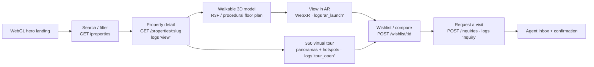
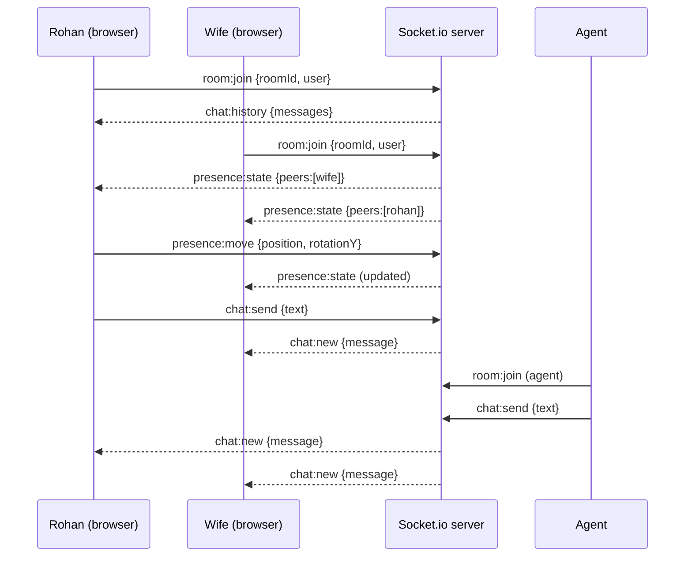
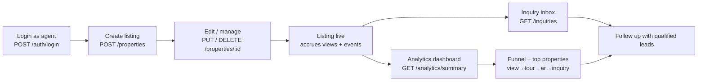
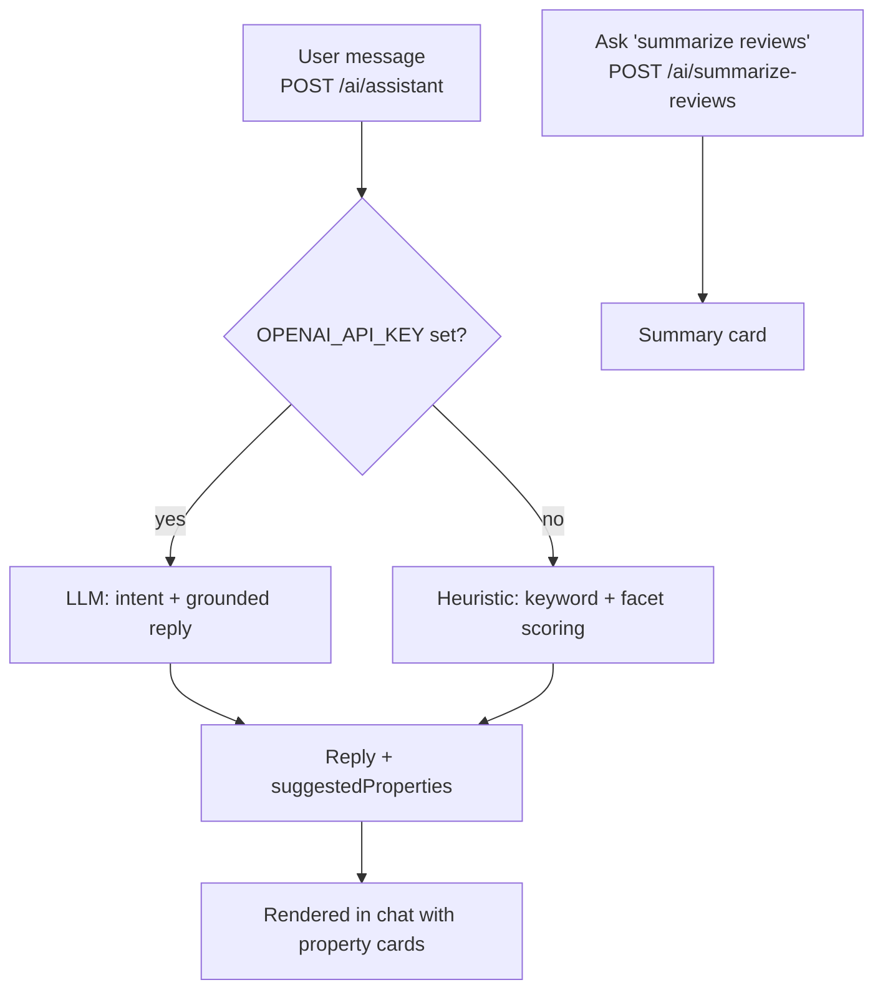

# 02 · User Journeys

> How real people move through Grovyn. Each journey is written as a narrative + a flow diagram, grounded in the actual routes and sockets in `SPEC.md`.

---

## Personas at a glance

| Persona | Role | Primary journey |
|---|---|---|
| **Aanya** — aspirational buyer | `user` | Browse → 3D → AR → tour → inquiry |
| **Rohan** — NRI / remote buyer | `user` | Shortlist → 360° tour → virtual showroom (together) → agent chat |
| **Meera** — agent | `agent` | Create listing → manage → inquiry inbox → analytics |
| **Concierge** — AI layer | system | Conversational discovery across all journeys |

---

## Journey 1 — Buyer: from browse to inquiry (the hero loop)

**Narrative.** Aanya lands on the Grovyn home page. A WebGL hero pulls her in; within seconds she understands this isn't another listings site. She searches "3BHK Bengaluru with pool," lands on a filtered grid, and opens a villa. The detail page loads a **walkable 3D model** — she orbits it, steps through rooms, then taps **View in AR** to scale-check the layout against her own living room. Still curious about flow, she opens the **360° tour** and hops between rooms via hotspots. Convinced, she hits **Request a visit**, the inquiry is logged, and the funnel records every step she took.

**Instrumented funnel:** `view → tour_open → ar_launch → inquiry` (each emits an `AnalyticsEvent`, surfaced in the agent/admin dashboard).

**Fallbacks along the path:**
- No WebXR? → **"Open on mobile / scan QR"** affordance; desktop keeps the interactive 3D view.
- No `.glb`? → **procedural 3D floor plan** from `rooms[]`.
- No panoramas? → gradient sky-dome tour still renders.
- API unreachable? → bundled `mockProperties` keeps the whole flow alive.

---

## Journey 2 — Remote buyer: touring together (the showroom)

**Narrative.** Rohan, in Dubai, has shortlisted a penthouse. He opens the **360° tour**, then invites his wife into the **multi-user virtual showroom**. Their avatars appear in the same space; as he moves, she sees him move (`presence:move` → `presence:state`). They discuss in **live chat**, which is persisted and also reaches the agent. When they have a question, the agent joins the same room and answers in real time. No flights, no time-zone gymnastics — a shared visit from two continents.

**Key point:** chat is **persisted** (`ChatMessage`) *and* broadcast, so the conversation survives reconnects and is visible to the agent later.

---

## Journey 3 — Agent: listing → leads → insight

**Narrative.** Meera signs in as an `agent`. She creates a listing — title, price, location, amenities, images, optional `.glb`, panoramas, and `rooms[]` for the procedural floor plan. It goes live and starts collecting views. Inquiries land in her **inbox** (`GET /inquiries`). On her **analytics dashboard** she sees the funnel — which listings get viewed, toured, AR-launched, and inquired about — so she knows exactly where to spend her follow-up energy.

---

## Journey 4 — AI concierge (cross-cutting)

**Narrative.** At any point, Aanya opens the concierge: *"Find me a 2BHK under ₹1.5Cr in Bengaluru near a park, good for resale."* The concierge interprets intent, queries the catalog, and replies conversationally with **suggested properties** inline. If an `OPENAI_API_KEY` is configured it uses an LLM; if not, it falls back to a **deterministic heuristic** that scores listings on the same signals — so the experience never breaks. On a property page she can also ask the concierge to **summarize the reviews**.

**Why it matters:** the concierge turns Grovyn from a *filtered list* into a *conversation* — and the heuristic fallback guarantees it works in any environment, including the evaluator's offline laptop.

---

## Cross-journey principles

1. **Every immersive step is logged** → the funnel is the product's spine.
2. **Every immersive step has a fallback** → the demo cannot hard-fail.
3. **Real-time is shared, not solo** → chat + showroom make property *social*.
4. **AI is ambient** → discovery is conversational wherever you are.
