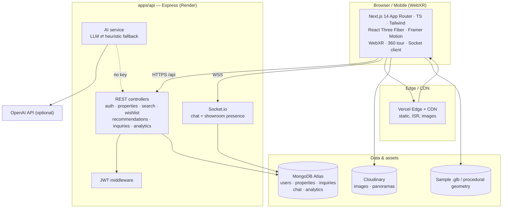
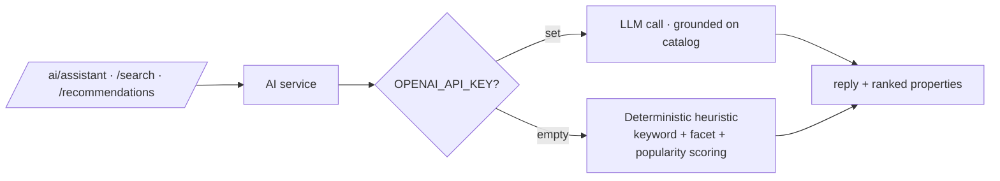
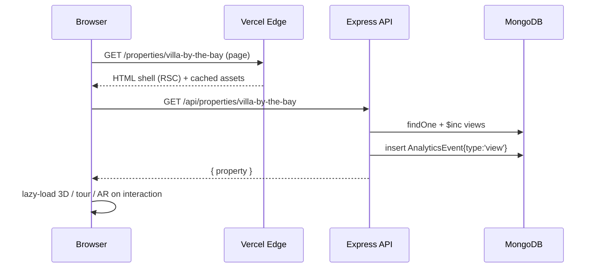

# 03 · Product & Technical Architecture

> How Grovyn is built. Grounded in `SPEC.md`: Next.js 14 + R3F web, Express + Mongoose + Socket.io API, MongoDB, Cloudinary, optional OpenAI.

---

## 1. System diagram



---

## 2. Monorepo layout

```
grovyn/
├── apps/
│   ├── web/                      # Next.js 14 (App Router)
│   │   ├── app/                  # routes: /, /properties, /properties/[slug], /agent, /dashboard
│   │   ├── components/           # 3D scenes, AR, tour, chat, concierge, glass UI
│   │   ├── lib/                  # api client, socket client, mockProperties fallback
│   │   └── styles/globals.css    # design tokens (obsidian + gold)
│   └── api/                      # Express + Mongoose + Socket.io
│       ├── src/models/           # User, Property, Inquiry, ChatMessage, AnalyticsEvent
│       ├── src/routes/           # auth, properties, search, ai, wishlist, ...
│       ├── src/services/         # ai (llm+heuristic), search, recommend, analytics
│       ├── src/sockets/          # chat + presence handlers
│       └── src/seed.ts           # npm run seed → 8–12 properties
├── docs/
└── SPEC.md
```

Each app is **independently installable** — no root workspace tooling — which keeps deploys to Vercel (web) + Render (api) trivial.

---

## 3. Frontend subsystem (apps/web)

| Concern | Choice | Notes |
|---|---|---|
| Framework | **Next.js 14 App Router + TS** | RSC for fast first paint; client components for 3D |
| Styling | **Tailwind** + CSS-var tokens | obsidian/gold design system from SPEC §2 |
| 3D | **React Three Fiber + drei** | walkable models, procedural floor plans from `rooms[]` |
| AR | **WebXR** (`immersive-ar`) | hit-test placement; QR/desktop fallback |
| 360° tour | equirect texture on sphere + hotspots | gradient sky-dome fallback |
| Motion | **Framer Motion** (+ optional GSAP) | respects `prefers-reduced-motion` |
| Realtime | **socket.io-client** | chat + showroom presence |
| Fonts | `next/font` — Clash Display / Sora + Inter | large hero type (clamp ~7rem) |
| Resilience | bundled `mockProperties` | renders fully if API is unreachable |

**Loading strategy:** all 3D is **lazy-loaded** and code-split; the hero degrades to a static gradient under reduced-motion. Target **60 FPS**.

---

## 4. Backend subsystem (apps/api)

- **Express** REST under `/api` (see `05-API-CONTRACT.md`), JSON everywhere, errors as `{ error: { message, code? } }`.
- **Mongoose** models exactly per SPEC §4.
- **JWT** auth (`Authorization: Bearer`), roles `user | agent | admin`; `passwordHash` never serialized.
- **Services layer** isolates business logic: `ai` (LLM ⇄ heuristic), `search` (hybrid scoring), `recommend` (wishlist/recent ⇄ trending), `analytics` (aggregation).
- **Socket.io** for chat + presence; chat persisted to `ChatMessage` and broadcast.

---

## 5. Realtime subsystem (Socket.io)

| Event | Direction | Purpose |
|---|---|---|
| `room:join` | client→server | join a property room (chat + showroom) |
| `chat:history` | server→client | backlog on join (from Mongo) |
| `chat:send` / `chat:new` | both | persist + broadcast messages |
| `presence:move` / `presence:state` | both | showroom avatar positions |
| `presence:leave` | server→client | peer disconnects |

Rooms are keyed by `roomId` (per property), so chat and showroom presence share one channel. Presence is **in-memory** (ephemeral, fast); chat is **durable** (Mongo).

---

## 6. AI subsystem (see `06-AI-PLAN.md`)



The heuristic guarantees the product is **fully functional offline** — a hard requirement from SPEC §3.

---

## 7. Data flow (read path example: property detail)



---

## 8. Scalability plan

| Layer | Strategy |
|---|---|
| **Static & images** | Vercel CDN + Cloudinary transforms (responsive, AVIF/WebP) |
| **Read scaling** | Index-backed queries (see `04-DATA-MODEL.md`); ISR/edge cache for catalog pages |
| **Caching** | HTTP cache for catalog & search; in-process LRU for trending/recommendations |
| **Horizontal API** | Stateless Express → scale out behind a load balancer |
| **Socket.io scale** | Sticky sessions + **Redis adapter** for multi-instance fan-out (roadmap) |
| **DB scaling** | Atlas replica set; shard by `city`/`propertyType` if needed |
| **AI scaling** | Heuristic is O(n) in-process; LLM calls async + cached by query |

---

## 9. Security

- JWT with expiry (`JWT_EXPIRES`), secret from env; **no secrets in code**.
- `passwordHash` (bcrypt) never returned; role-gated write/admin routes.
- CORS locked to `CLIENT_ORIGIN`.
- Input validation on all bodies; rate-limit auth + inquiry endpoints (roadmap).
- Cloudinary signed uploads; HTTPS/WSS everywhere in production.

---

## 10. Observability

- `GET /health` liveness probe.
- **AnalyticsEvent** stream doubles as product telemetry (view/ar/tour/inquiry/search).
- Structured request logging on the API; client error boundaries report render failures.
- Dashboard (`/analytics/summary`) exposes funnel + top properties for operators.

---

## 11. Performance budget

| Metric | Target |
|---|---|
| Lighthouse Performance | **≥ 95** |
| Lighthouse Accessibility | **≥ 95** |
| LCP | < 2.0s |
| CLS | < 0.1 |
| INP | < 200ms |
| 3D frame rate | 60 FPS (degrade gracefully under reduced-motion) |
| JS shipped on first paint | minimized — 3D code-split & lazy |

**How we hit it:** RSC-first rendering, code-splitting all 3D/AR, lazy hydration, Cloudinary-optimized media, `prefers-reduced-motion` static fallbacks, and no heavy 3D on the critical path.
