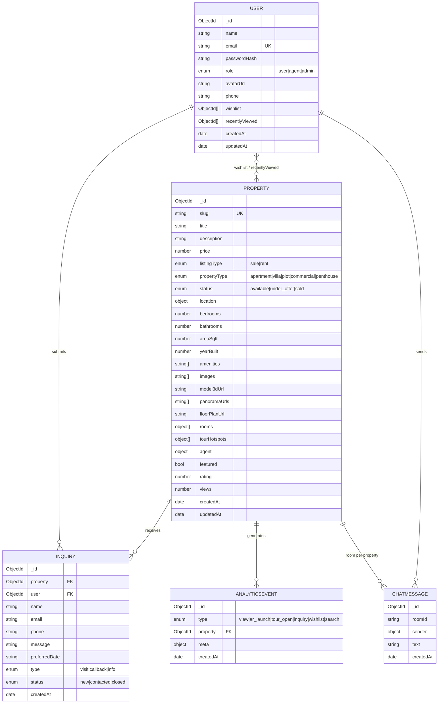

# 04 · Data Model

> Canonical entities from `SPEC.md §4`, expressed as an ER overview with field notes and an indexing strategy. MongoDB / Mongoose.

---

## 1. ER overview

---

## 2. Entity field notes

### User
- `email` — **unique, lowercased**; the login key.
- `passwordHash` — bcrypt; **never serialized** to clients.
- `role` — gates write/admin routes (`agent`/`admin` can manage properties; `admin` + `agent` see analytics).
- `wishlist` — array of `Property` refs; toggled via `POST /wishlist/:propertyId`.
- `recentlyViewed` — **capped at 20** (FIFO); powers recommendations and `/me/recent`.

### Property — the core entity
- `slug` — **unique**, URL key for `GET /properties/:slug`.
- `price` — INR (number).
- `location` — embedded `{ address, city, state, country, lat, lng }`; `lat/lng` enable future map discovery.
- `model3dUrl` — optional `.glb`; if absent, web renders a **procedural 3D floor plan** from `rooms[]`.
- `panoramaUrls` — equirectangular 360° stops; empty → gradient sky-dome fallback.
- `rooms[]` — `{ name, w, d, x, z }`; the offline-safe source of truth for the floor plan.
- `tourHotspots[]` — `{ panoramaIndex, label, yaw, pitch, target? }`; navigation between tour stops.
- `agent` — embedded snapshot `{ name, phone, email, avatarUrl? }` (denormalized for fast listing render).
- `featured` — monetization flag (paid placement).
- `views` — counter incremented on detail fetch.

### Inquiry
- Links a (possibly anonymous) buyer to a `property`; `user` optional for guest inquiries.
- `type` (`visit`/`callback`/`info`) + `status` lifecycle (`new`→`contacted`→`closed`) drive the agent inbox.

### ChatMessage
- `roomId` = per-property room; `sender { id?, name, role }` denormalized for render.
- **Persisted** (so chat history survives reconnects) *and* broadcast over Socket.io.

### AnalyticsEvent
- The platform's telemetry spine; `type` enumerates the funnel.
- `meta` is a flexible bag (e.g., search query, device). Powers `/analytics/summary`.

---

## 3. Indexing strategy

| Collection | Index | Why |
|---|---|---|
| **User** | `{ email: 1 }` unique | login lookup |
| **Property** | `{ slug: 1 }` unique | detail route |
| **Property** | `{ city: 1, propertyType: 1, listingType: 1 }` | primary filter combo |
| **Property** | `{ price: 1 }`, `{ createdAt: -1 }`, `{ views: -1 }` | sort by price / newest / popular |
| **Property** | `{ featured: 1 }` | featured queries |
| **Property** | **text index** on `title, description, amenities, location.city` | keyword leg of hybrid search |
| **Inquiry** | `{ property: 1, createdAt: -1 }`, `{ status: 1 }` | agent inbox |
| **ChatMessage** | `{ roomId: 1, createdAt: 1 }` | chat history fetch |
| **AnalyticsEvent** | `{ type: 1, createdAt: -1 }`, `{ property: 1 }` | funnel + per-property rollups |

**Notes**
- The compound filter index mirrors the most common `GET /properties` query shape; sort fields are separately indexed so the planner can satisfy `sort` without scanning.
- The **text index** powers the keyword component of hybrid search; the semantic component layers on top (heuristic now, vector DB on the roadmap — see `06-AI-PLAN.md`).
- `recentlyViewed` is bounded (cap 20) so the `User` doc stays small and write-cheap.
- For scale, `AnalyticsEvent` is a natural candidate for a **time-series collection** / TTL on raw events with rolled-up daily aggregates.
