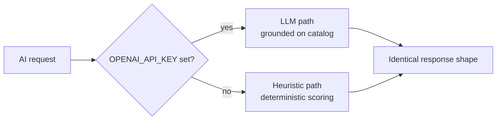

# 06 · AI Integration Plan

> How intelligence layers onto Grovyn — and why it **never breaks**, even with no API key. Endpoints: `/ai/assistant`, `/ai/summarize-reviews`, `/search`, `/recommendations`.

---

## 1. Principle: graceful, no-key by design

Per `SPEC.md §3`, if `OPENAI_API_KEY` is empty, **every** AI surface degrades to a deterministic local heuristic. The app is fully functional offline. This is a product decision, not a fallback hack: the evaluator's laptop, an air-gapped demo, or a rate-limited key must all yield a working concierge, search, and recommendations.



Both paths return the **same response shape** so the frontend is agnostic to which ran.

---

## 2. AI surfaces

### 2.1 AI Property Concierge — `POST /ai/assistant`

**Purpose:** conversational discovery. User asks in natural language; concierge replies with a grounded answer + `suggestedProperties[]`.

- **LLM path:** system prompt frames it as a Grovyn real-estate concierge; the current catalog (or a filtered candidate set) is provided as grounding context so it recommends *real* listings, not hallucinations. Optional `context.propertyId` focuses the conversation on one property.
- **Heuristic path:** parse the latest user message → extract facets (city, budget range, bedrooms, property type, amenities, intent keywords like "park", "sea-facing", "resale") via keyword + regex matching → score every property and return the top matches with a templated, natural-sounding reply.

**Why the heuristic is good enough:** real-estate intent is highly structured (location + budget + type + amenities). A facet extractor captures ~90% of practical queries without embeddings.

### 2.2 Semantic / hybrid search — `GET /search`

**Purpose:** results that understand meaning, not just exact keywords.

```
final_score = w_kw · keyword_score        (Mongo text index / BM25-style)
            + w_sem · semantic_score       (LLM-embedding cosine OR heuristic synonym/facet overlap)
            + w_pop · popularity_score      (normalized views)
            + w_feat · featured_boost
```

- **LLM path:** query + listing embeddings → cosine similarity for `semantic_score`.
- **Heuristic path:** a curated synonym/concept map ("sea-facing"≈"beachfront"≈"ocean view"; "starter"≈"1BHK/2BHK budget") plus facet overlap approximates semantic similarity deterministically.
- Always returns `suggestions[]` (query reformulations) to keep discovery flowing.

### 2.3 Recommendation engine — `GET /recommendations`

**Purpose:** "homes for you."

- **Signals:** `wishlist` + `recentlyViewed` (content-based: shared city / type / price band / amenities), with a human-readable `reason`.
- **Cold start / anonymous:** fall back to **trending** (popularity over a recent window).
- Same logic underpins `GET /properties/:id/similar` (content-based neighbors of one property).

### 2.4 Review summarizer — `POST /ai/summarize-reviews`

**Purpose:** distill sentiment into one trustworthy paragraph.

- **LLM path:** summarize review text into pros/cons + overall sentiment.
- **Heuristic path:** aggregate `rating` + amenity highlights into a templated summary ("Buyers consistently praise the natural light and the amenities; rated 4.7/5.").

---

## 3. Response-shape contract (frontend-agnostic)

| Endpoint | Shape (same for both paths) |
|---|---|
| `/ai/assistant` | `{ reply: string, suggestedProperties?: Property[] }` |
| `/ai/summarize-reviews` | `{ summary: string }` |
| `/search` | `{ items: Property[], suggestions: string[] }` |
| `/recommendations` | `{ items: Property[], reason: string }` |

The frontend never branches on "is AI on?" — it just renders the response.

---

## 4. Heuristic scoring — worked example

Query: *"2BHK under ₹1.5Cr in Bengaluru near a park, good for resale"*

| Signal | Extracted | Match logic |
|---|---|---|
| bedrooms | 2 | `bedrooms === 2` (soft ±1) |
| budget | ≤ 15,000,000 | `price <= max` (penalty if over) |
| city | Bengaluru | exact + fuzzy on `location.city` |
| amenity/intent | "park", "resale" | keyword overlap on `amenities`/`description`; resale ≈ `propertyType in {apartment}` + appreciation hints |

Each property gets a weighted sum; top-N returned. Deterministic, explainable, fast — and it runs anywhere.

---

## 5. Future vector-DB roadmap

| Phase | Capability |
|---|---|
| **Now (MVP)** | Mongo text index + heuristic semantic layer; optional LLM concierge |
| **Phase 2** | Real embeddings (OpenAI / open models) stored in **pgvector / Pinecone / Mongo Atlas Vector Search**; cosine retrieval + cross-encoder reranking |
| **Phase 3** | **RAG concierge** grounded on listing docs, neighborhood data, legal FAQs; tool-use to query live inventory |
| **Phase 4** | Learned ranking (collaborative + content signals), price prediction, image-based similarity (CLIP over property photos), **voice concierge** |

The MVP is deliberately architected so swapping the heuristic `semantic_score` for an embedding lookup is a **localized change** behind the AI service — no API or frontend contract changes.

---

## 6. Safety & cost controls

- **Grounding:** concierge always answers from the real catalog; no invented listings.
- **Caching:** LLM responses cached by normalized query to cap cost.
- **Timeouts + fallback:** any LLM error or timeout transparently falls back to the heuristic.
- **No PII to the model** beyond the message and public catalog data.
