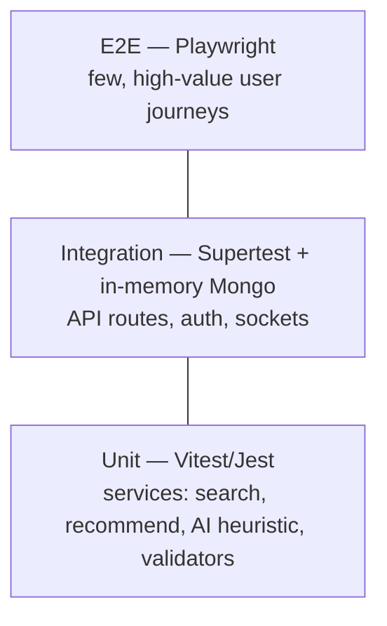
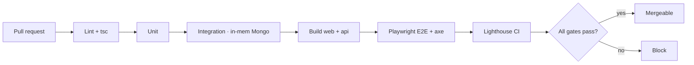

# 07 · Testing Strategy

> A pragmatic test pyramid sized for a 24h build that must still feel production-grade. Confidence over coverage theater.

---

## 1. Philosophy

- **Test the contracts, not the implementation.** The API contract (`05-API-CONTRACT.md`) and socket events are the seams; lock those.
- **Protect the fallbacks.** Every graceful-degradation path (no AI key, no DB, no `.glb`, no WebXR) is a *feature* and gets an explicit test.
- **Performance & accessibility are tests, not vibes.** Lighthouse and axe run in CI.

---

## 2. The pyramid

| Layer | Tool | What it covers |
|---|---|---|
| **Unit** | Vitest / Jest | heuristic scoring, search ranking, recommendation logic, JWT helpers, Zod/validators, slug/price formatting |
| **Integration** | Supertest + `mongodb-memory-server` | every REST route incl. auth + role gating; error envelope; socket chat/presence handlers |
| **E2E** | Playwright | the hero journeys (browse→3D→AR-entry→inquiry; agent create-listing; concierge chat) |
| **Accessibility** | `@axe-core/playwright`, eslint-jsx-a11y | AA contrast, keyboard nav, focus, reduced-motion, alt text |
| **Performance** | Lighthouse CI, WebPageTest | LCP/CLS/INP budgets, bundle size, 3D lazy-load |
| **Type safety** | `tsc --noEmit` | TS everywhere; build must pass (SPEC §8) |
| **Lint/format** | ESLint + Prettier | consistency |

---

## 3. Critical test cases (representative)

### API / integration
- `POST /auth/register` returns a token and a user **without `passwordHash`**.
- `POST /properties` is **403** for `role: user`, **201** for `agent`.
- `GET /properties` honors `city/propertyType/price/sort/page` and returns `{items,total,page,pages}`.
- `GET /properties/:slug` **increments `views`** and writes a `view` AnalyticsEvent.
- `POST /inquiries` creates an inquiry and logs an `inquiry` event.
- Errors return the `{ error: { message, code? } }` envelope with correct status.

### AI fallback (the headline)
- With `OPENAI_API_KEY` **unset**, `/ai/assistant`, `/search`, `/recommendations` all return valid, populated responses (deterministic heuristic).
- Heuristic scoring is **stable** for a fixed query (snapshot test).
- LLM timeout/error **transparently falls back** to heuristic.

### Realtime
- `room:join` returns `chat:history`; `chat:send` persists a `ChatMessage` and broadcasts `chat:new`.
- `presence:move` fans out `presence:state`; disconnect emits `presence:leave`.

### Frontend resilience
- API unreachable → app renders with bundled `mockProperties`.
- No WebXR → AR entry shows **QR / "open on mobile"** affordance (no crash).
- No `.glb` → procedural floor plan renders from `rooms[]`.
- No panoramas → gradient sky-dome tour renders.

### Accessibility
- Home, listing grid, and detail pages pass axe with **zero serious violations**.
- All interactive controls are keyboard-reachable with visible focus.
- `prefers-reduced-motion` disables non-essential animation and heavy 3D autoplay.

---

## 4. Performance gates (CI)

| Check | Gate |
|---|---|
| Lighthouse Performance | **≥ 95** |
| Lighthouse Accessibility | **≥ 95** |
| LCP / CLS / INP | < 2.0s / < 0.1 / < 200ms |
| First-load JS (critical path) | budgeted; 3D excluded via code-split |

---

## 5. CI flow

---

## 6. Manual demo checklist (pre-recording)

- [ ] Hero loads < 3s, 60 FPS, reduced-motion variant works
- [ ] 3D model + procedural floor plan both render
- [ ] AR launches on a real phone; QR fallback on desktop
- [ ] 360° tour hotspots navigate
- [ ] Concierge answers with + without an API key
- [ ] Live chat + showroom presence sync across two browsers
- [ ] Inquiry submits and appears in agent inbox
- [ ] Analytics funnel populates
