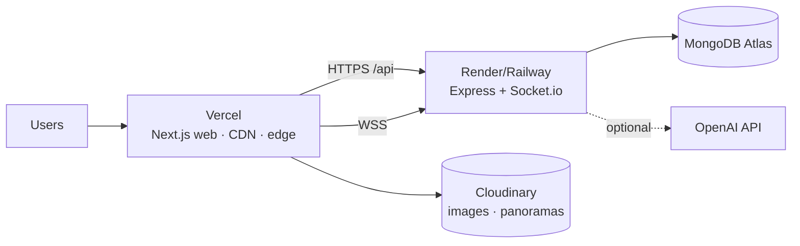
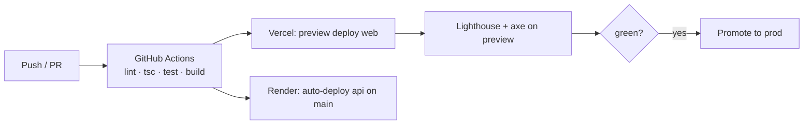

# 08 · Deployment

> Ship Grovyn: **Vercel** (web) · **Render / Railway** (api) · **MongoDB Atlas** · **Cloudinary**. Two independently deployable apps — exactly the shape SPEC §1 is built for.

---

## 1. Topology



---

## 2. Web — Vercel (apps/web)

1. Import the repo; set **Root Directory** = `apps/web`.
2. Framework preset: **Next.js** (auto). Build: `next build`. Output: default.
3. **Env vars** (Project → Settings → Environment Variables):
   ```
   NEXT_PUBLIC_API_URL=https://grovyn-api.onrender.com/api
   NEXT_PUBLIC_SOCKET_URL=https://grovyn-api.onrender.com
   ```
4. Deploy → preview URL per PR; production on `main`.
5. **Custom domain:** add `grovyn.in` / `app.grovyn.in` in Vercel → Domains; point DNS (A/ALIAS or CNAME to `cname.vercel-dns.com`); SSL auto-provisioned.

> Because the API base + socket URL are env-driven and the web app falls back to `mockProperties`, the frontend deploys and renders even before the API is up.

---

## 3. API — Render (apps/api)

1. New **Web Service** → repo → **Root Directory** = `apps/api`.
2. Build: `npm install && npm run build` · Start: `npm start` (compiled JS).
3. **Env vars:**
   ```
   PORT=5000                       # Render injects PORT; bind to it
   MONGODB_URI=<Atlas SRV URI>
   JWT_SECRET=<strong-random>
   JWT_EXPIRES=7d
   CLIENT_ORIGIN=https://app.grovyn.in
   OPENAI_API_KEY=                 # optional; heuristic fallback if empty
   ```
4. **Socket.io note:** enable WebSocket support (Render supports it by default); ensure CORS `origin` = `CLIENT_ORIGIN`. For multi-instance scale, add the **Redis adapter** (roadmap).
5. **Health check path:** `/api/health` → `{ ok: true }`.
6. Run **`npm run seed`** once (Render shell / one-off job) to load 8–12 demo properties + demo users.

> **Railway** is a drop-in alternative: same root dir, build/start commands, and env vars; add a Railway-managed Redis when scaling sockets.

---

## 4. Database — MongoDB Atlas

1. Create a free/shared **M0** cluster (or M10+ for prod).
2. **Network access:** allowlist Render egress IPs (or `0.0.0.0/0` for demo only).
3. **DB user** with read/write on the `grovyn` DB.
4. Copy the **SRV connection string** → `MONGODB_URI`.
5. Indexes from `04-DATA-MODEL.md` are created on boot (Mongoose `index: true` / `ensureIndexes`).

---

## 5. Media — Cloudinary

1. Create a Cloudinary account; note `cloud_name`, API key/secret.
2. Use **signed uploads** for agent-submitted images; serve via Cloudinary URLs with responsive transforms (AVIF/WebP, `f_auto,q_auto`).
3. Seed data may use Unsplash URLs directly; production media flows through Cloudinary.

---

## 6. Environment matrix

| Variable | Web | API | Notes |
|---|:--:|:--:|---|
| `NEXT_PUBLIC_API_URL` | Built | | public; points at API `/api` |
| `NEXT_PUBLIC_SOCKET_URL` | Built | | public; socket origin |
| `MONGODB_URI` | | Built | secret |
| `JWT_SECRET` / `JWT_EXPIRES` | | Built | secret / config |
| `CLIENT_ORIGIN` | | Built | CORS + socket origin |
| `OPENAI_API_KEY` | | Built | optional |
| Cloudinary creds | | Built | secret (signed uploads) |

**No secrets in code** (SPEC §8) — all from env.

---

## 7. CI/CD



- PRs get a **Vercel preview** + the full CI gate from `07-TESTING-STRATEGY.md`.
- `main` auto-deploys web (Vercel) and api (Render).
- Rollback = redeploy previous Vercel deployment / Render image.

---

## 8. Go-live checklist

- [ ] Atlas reachable from Render; `npm run seed` run once
- [ ] `GET /api/health` returns `{ ok: true }`
- [ ] CORS `CLIENT_ORIGIN` matches the web domain; WSS works cross-origin
- [ ] Web env points at the live API + socket URLs
- [ ] Custom domain + SSL active on Vercel
- [ ] Lighthouse 95+ on production home + listing pages
- [ ] AR works on a real phone; QR fallback on desktop
- [ ] App still renders if API is briefly down (mock fallback)
