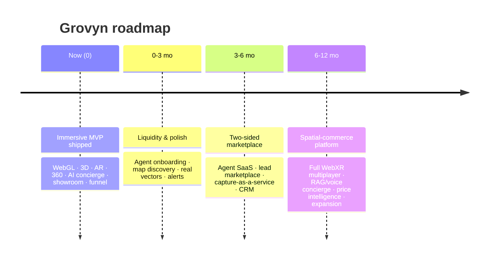

# 11 · Product Roadmap (0–3–6–12)

> Framed as a startup, not a class project. Each horizon ties to a strategic objective, key features, and the metric that proves it worked.

---

## North star

**Maximize qualified, immersive intent** — the share of buyers who move through *view → tour → AR → inquiry* with high confidence. Everything below ladders up to that.

---

## Horizon 0 — Now (shipped MVP)

**Objective:** prove the immersive thesis end-to-end.

- WebGL hero, walkable 3D + procedural floor plans, WebXR AR, 360° tours.
- AI concierge + hybrid search + recommendations (with no-key fallback).
- Live agent chat + multi-user virtual showroom.
- Wishlist, recently viewed, inquiries, analytics funnel.
- Lighthouse 95+, graceful degradation everywhere.

**Proof metric:** immersive activation rate (% sessions opening 3D/AR/360) > 40%.

---

## Horizon 1 — 0–3 months · *Liquidity & polish*

**Objective:** fill the catalog and sharpen discovery.

| Theme | Initiatives |
|---|---|
| **Supply** | Self-serve **agent onboarding**, bulk listing import, listing quality scoring |
| **Discovery** | **Map-based search** (uses stored `lat/lng`), saved searches, **price-drop / status alerts** |
| **AI** | Swap heuristic semantic layer for **real embeddings** (Atlas Vector Search / pgvector) + reranking |
| **AR/VR** | AR **measurement + occlusion**, dollhouse view for tours |
| **Trust** | Verified agents, richer reviews + AI review summaries surfaced on cards |

**Proof metric:** inquiries per 100 immersive sessions > 5; catalog size 10×.

---

## Horizon 2 — 3–6 months · *Two-sided marketplace*

**Objective:** turn engagement into revenue.

| Theme | Initiatives |
|---|---|
| **Monetization** | **Agent SaaS tiers** (listing slots + 3D/AR tooling + analytics); **featured placement** marketplace; **per-qualified-lead** pricing |
| **Supply tooling** | Lightweight **CRM** + automated lead qualification; agent performance analytics (cohorts, attribution) |
| **Immersive production** | **Capture-as-a-service** (3D/360 production) as a premium upsell + moat |
| **Scale** | Socket.io **Redis adapter**, edge caching, CDN tuning |

**Proof metric:** first ₹ of recurring agent revenue; paying-agent retention.

---

## Horizon 3 — 6–12 months · *Spatial-commerce platform*

**Objective:** become the default surface for immersive property.

| Theme | Initiatives |
|---|---|
| **Immersive** | **Full WebXR multiplayer** showrooms with spatial audio; guided cinematic tours |
| **AI** | **RAG concierge** (neighborhood, legal, financing) + **voice concierge**; learned ranking; image-based similarity (CLIP); **price intelligence** |
| **Marketplace** | **Developer launches** (sponsored virtual showrooms for new projects); buyer concierge (AI + human) |
| **Expansion** | New cities + adjacent verticals (commercial, vacation rentals); API/partner platform |

**Proof metric:** multi-city GMV influenced; net revenue retention > 120%.

---

## Sequencing logic

1. **Liquidity before monetization** — you can't charge agents until buyers show up; H1 fills supply and sharpens discovery.
2. **Monetize the side that pays** — H2 charges agents for reach, tooling, and qualified intent (buyer side stays free for liquidity).
3. **Defensibility through production** — capture-as-a-service + immersive multiplayer are the moats competitors can't quickly copy.
4. **AI compounds** — each horizon deepens the AI seam already architected in the MVP, so upgrades are localized, not rewrites.
